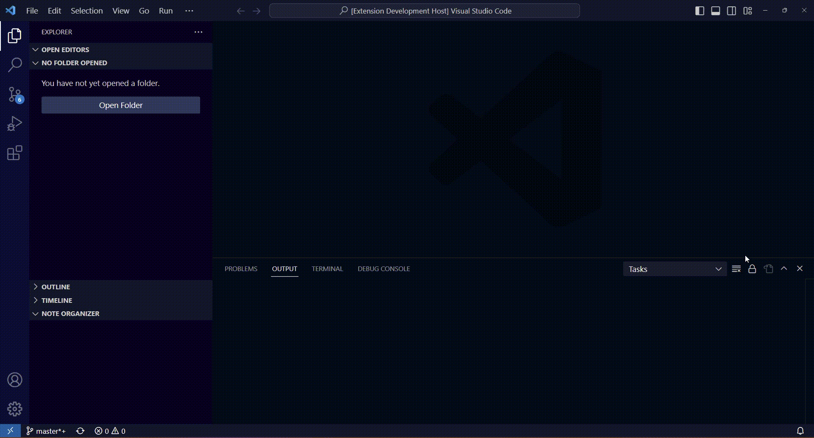
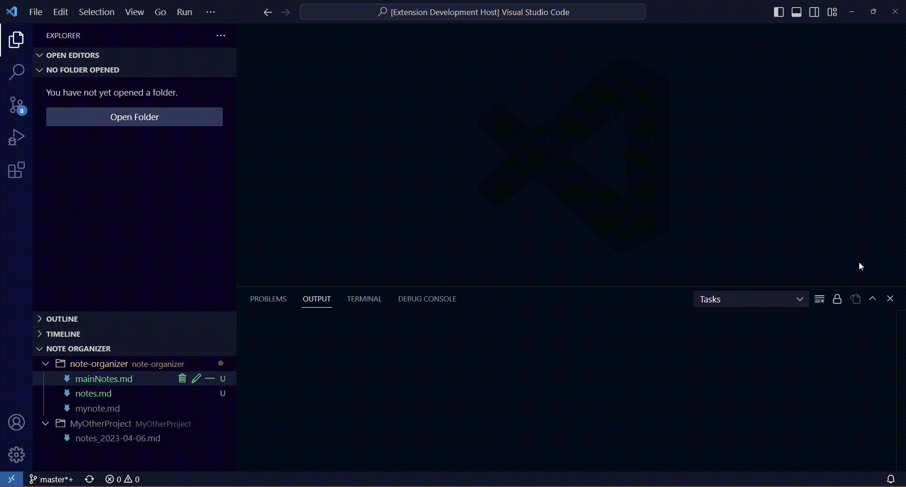
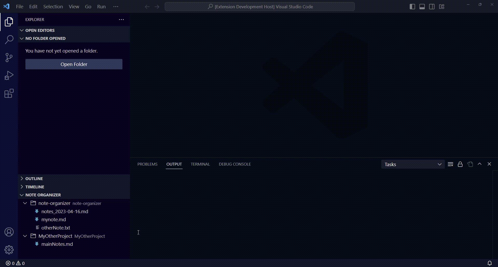

# note-organizer README

Quickly find your already existing Markdown and text file notes across all of your project. Easily organize and create new notes.

## Features

Scan your computer and automatically find note files.

Quickly open your note file.

Move, rename, create or delete your notes easily.

## Extension Settings

This extension contributes the following settings:

* `noteOrganizer.noteFileRegex`: The regex used to filter file while scanning for notes. The filename should match the given regex to be considered a note file.
* `noteOrganizer.projectInnerFileRegex`: The regex used to find out if a given folder should be considered as a project while scanning for notes. For a given folder `/a/b/`, `b` would be considered a project if any of its sub file and folder match this regex. By default, filter on `.vscode` files.
* `noteOrganizer.folderScanRegex`: The regex used to find out if a given folder should be scan while scanning for notes. For a given folder `/a/b/`, `b` would be scan only if `b` match this regex. By default, no filtering.
* `noteOrganizer.maxRecursionDepth`: The maximum depth we should scan.
* `noteOrganizer.scanConcurrency`: The maximum concurrency while scanning for notes.

## Known Issues

See https://github.com/jacquemard/vscode-note-organizer/issues for issues and bug reports.

## Release Notes

### 0.0.1

Initial pre-release
