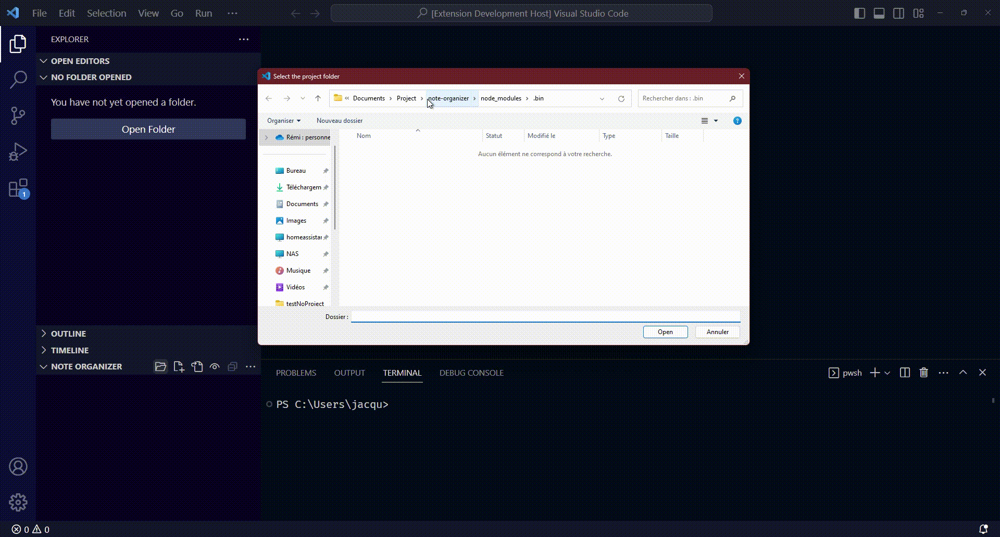
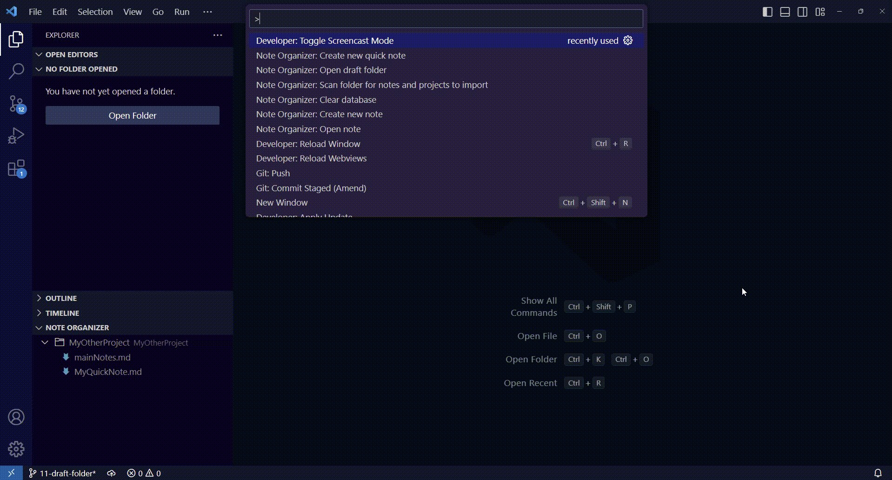

# Note organizer

This extension provides a way to quickly find your already existing Markdown and text file notes, doing so across all of your project. It let you easily organize and create new notes within your projects.

## Features

**Scan your computer and automatically find note files**

It looks for `.txt` and `.md` files having `note` within their name (configurable with setting `noteOrganizer.noteFileRegex`). Automatically groups the found notes in distinct project based on `.vscode` project it can find. Also finds all of your projects, even if there is no note within it, so you can quickly create new notes in these projects.

**Import new project, and scan them for all text or markdown files**

**Quickly open your existing note file.**

**Move, rename, create or delete your notes easily**

**Create new quick notes to the draft folder** (Customizable with the `noteOrganizer.draftFolder` setting).

## First setup

You'll need to add your existing notes and projects to this extension. To do so, the automatic scan is recommended. Find the command "Note Organizer: Scan folder for notes and projects to import", choose the folder containing your projects, and it will start scanning this folder and all of its subfolders, finding all VSCode project and notes.

If there is some projects or notes you'd want but the scanner didn't find them, you can add them manually in the Note Organizer, under the explorer view.

If you use a generic "Note" folder containing all of your notes, you can add it as a project. When asked for scanning, choose "All .md and .txt files".

## Extension Settings

This extension contributes the following settings:

* `noteOrganizer.noteFileRegex`: The regex used to filter file while scanning for notes. The filename should match the given regex to be considered a note file.
* `noteOrganizer.projectInnerFileRegex`: The regex used to find out if a given folder should be considered as a project while scanning for notes. For a given folder `/a/b/`, `b` would be considered a project if any of its sub file and folder match this regex. By default, filter on `.vscode` files.
* `noteOrganizer.folderScanRegex`: The regex used to find out if a given folder should be scan while scanning for notes. For a given folder `/a/b/`, `b` would be scan only if `b` match this regex. By default, no filtering.
* `noteOrganizer.maxRecursionDepth`: The maximum depth we should scan.
* `noteOrganizer.scanConcurrency`: The maximum concurrency while scanning for notes.
* `noteOrganizer.draftFolder`: The folder where to save the quick note. Defaults to extension folder if empty.

## Known Issues

See https://github.com/jacquemard/vscode-note-organizer/issues for issues and bug reports. Feature requests welcome!

## Release Notes

See the [Changelog](./CHANGELOG.md) for more info on the releases.
